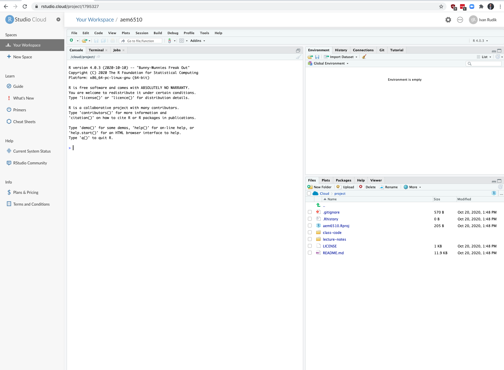
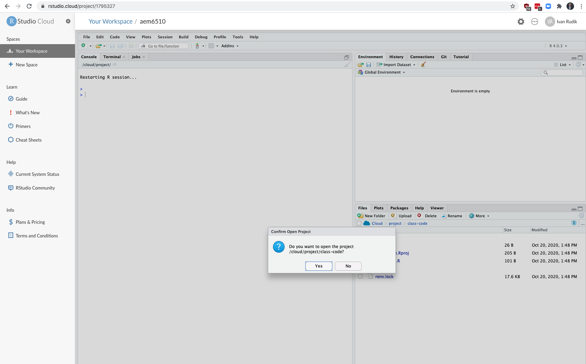
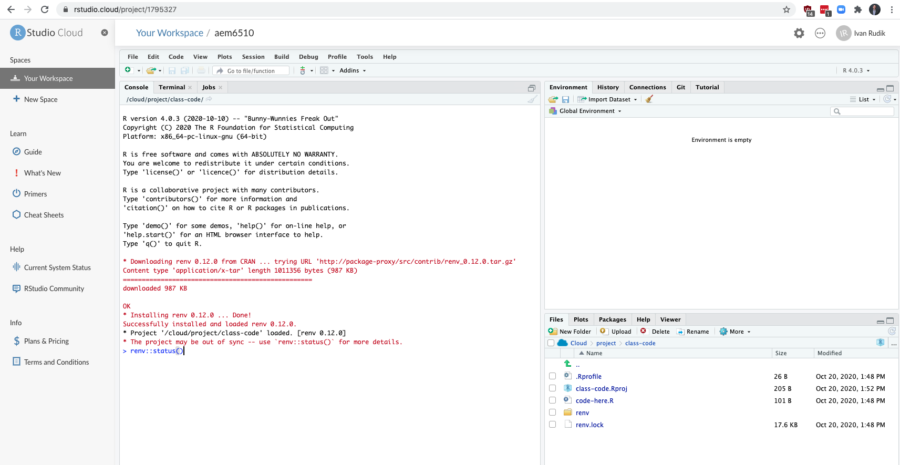
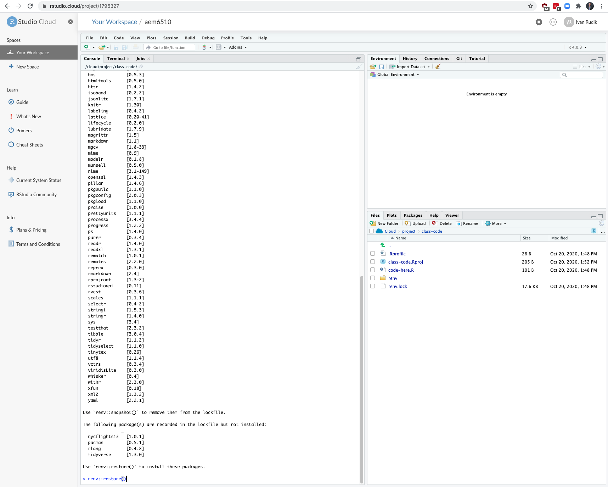

exclude: true
```{r setup}
if (!require("pacman")) install.packages("pacman")
pacman::p_load(
  tidyverse, xaringanExtra, rlang, patchwork, nycflights13
)
options(htmltools.dir.version = FALSE)
knitr::opts_hooks$set(fig.callout = function(options) {
  if (options$fig.callout) {
    options$echo <- FALSE
  }
knitr::opts_chunk$set(echo = TRUE, fig.align="center")
  options
})
```
```{r xaringanExtra, echo = FALSE}
xaringanExtra::use_xaringan_extra(c("tile_view", "panelset", "webcam"))

```
```{r echo=FALSE}
xaringanExtra::style_panelset(panel_tab_color_active = "red")
```

---

# Roadmap

- What is R?
- What is the tidyverse?
- How do we import and manipulate data?

Our goal is to take a hands on approach to learning how we do environmental economics research

A good chunk of this lecture comes from Grant Mcdermott's [data science for economists](https://github.com/uo-ec607/lectures) notes, and [RStudio education](https://education.rstudio.com/)

---

class: inverse, center, middle
name: r

# RStudio Cloud

<html><div style='float:left'></div><hr color='#EB811B' size=1px width=796px></html>

---

# Getting started

We will be using [rstudio.cloud](https://rstudio.cloud) for our coding

--

Why?

--

You don't need to download/install anything

--

I can prepare the packages and code and make it easy to download

--

Let's get everything going...

---

# Getting started: login 


---

# Getting started: new project from github 


---

# Getting started: new project from github 


---

# Getting started: wait for deployment


---

# Click on class-code in bottom-right



---

# Click on class-code.Rproj


---

# Click yes

```{r, echo = FALSE, fig.align = "center"}

```


---

# Check package status (not required)

```{r, echo = FALSE, out.width = "80%", fig.align = "center"}

```

---

# Install packages (then press 'y')

```{r, echo = FALSE, out.width = "60%", fig.align = "center"}

```

---

class: inverse, center, middle
name: r

# Quick intro to R

<html><div style='float:left'></div><hr color='#EB811B' size=1px width=796px></html>

---

# Arithmetic operations

R can do all the standard arithmetic operations

```{r}
1+2 ## add
6-7 ## subtract
5/2 ## divide
```

---

# Logical operations

You also have logical operations

```{r}
1 > 2
(1 > 2) | (1 > 0.5) # | is the or operator
(1 > 2) & (1 > 0.5) # & is the and operator
```

---

# Logical operations

We can negate expressions with: `!`

This is helpful for filtering data

```{r}
is.na(1:10)
!is.na(1:10)
```

---

# Logical operators

For value matching we use: `%in%`

To see whether an object is contained within (i.e. matches one of) a list of items, use `%in%`.
```{r}
4 %in% 1:10
4 %in% 5:10
```

This is kind of like an `any` command in other languages

---

# Logical operators

Turns out there's no %notin%, but we can make one using `Negate`

--

```{r}
`%notin%` <- Negate(`%in%`) ## The backticks (`) help to specify functions.
4 %notin% 5:10
```

---

# Logical operators 

To evaluate whether two expressions are equal, we need to use .hi-red[two] equal signs

```{r, error=T}
1 = 1 ## This doesn't work
1 == 1 ## This does.
1 != 2 ## Note the single equal sign when combined with a negation.
```


---

# Assignment

In R, we can use either `=` or `<-` to handle assignment.<sup>1</sup>

.footnote[
<sup>1</sup> The `<-` is really a `<` followed by a `-`. It just looks like an arrow because of the font on the slides.
]

--

`<-` is normally read aloud as "gets"

You can think of it as a (left-facing) arrow saying .hi[assign in this direction]

---

# Assignment

```{r}
a <- 10 + 5
a
```

--

An arrow can point in the other direction too (i.e. `->`), this is used less frequently though
```{r}
10 + 5 -> a
a
```

---

# Assignment

You can also use `=` for assignment, but the object must be on the left

```{r}
b = 10 + 10 
b
```

---

# Which assignment operator to use?

Most R folks prefer `<-` for assignment

.footnote[In RStudio you can assign `<-` to a hotkey to make using it as easy as `=`]

--

`=` has a specific role for evaluation *within* functions, we don't want to mix them up

--

It doesn't really matter though, other languages use `=` for both 

--

Use whatever you prefer, just be consistent

---

# Help

If you are struggling with a (named) function or object in R, simply type `?commandhere`
  
```R
?Negate 
```

---

# Help 

Also try `vignette()` for a more detailed introduction to many packages

```R
# Try this:
vignette("dplyr")
```

--

Vignettes are a very easy way to learn how and when to use a package

---

# Object-oriented programming

In R:
> "Everything is an object and everything has a name."

---

# What are objects? 

We won't go into OOP details but here are some objects that we'll be working with regularly:
- vectors
- matrices
- data frames
- lists
- functions
- etc.

--

A lot of these are probably familiar if you have coding experience

--

But there are always language-specific features/subtleties

---

# Global environment

```{r df}
## Create a small data frame called "df".
df <- data.frame(x = 1:2, y = 3:4) 
df
```

--

Now, let's try to run a regression<sup>1</sup> on these "x" and "y" variables:

.footnote[
<sup>1</sup> Yes, this is a dumb regression with perfectly co-linear variables. Just go with it. 
]

---

# Global environment

```{r, eval = F, error = T}
lm(y ~ x) ## The "lm" stands for linear model(s)
```

---

# Global environment

```{r, error=T}
lm(y ~ x) ## The "lm" stands for linear model(s)
```

--

Error?

---

# Global environment

The error message is

```
*## Error in eval(predvars, data, env): object 'y' not found
```

--

R can't find the variables that we've supplied in our [Global Environment](https://www.datamentor.io/r-programming/environment-scope/)

--

Can you find x or y in the RStudio panel?

---

# Global environment

We have to tell R `x` and `y` are a part of the object `df`


--

How?

--

There are a various ways to solve this problem. One is to simply specify the datasource:

```{r}
lm(y ~ x, data = df) ## Works when we add "data = df"!
```

---

# Global environment: why it matters

This matters largely for Stata users

--

In Stata, the workspace is basically just a single data frame $\Rightarrow$ all variables are in the global environment

--

Big problem with this is you can't have multiple data frames / datasets in memory


---

# Working with multiple objects

We can create a second data frame in memory!

```{r df2}
df2 <- data.frame(x = rnorm(10), y = runif(10))
df
df2
```

---

# Reserved words

R has a bunch of key/reserved words that serve specific functions

See [here](http://stat.ethz.ch/R-manual/R-devel/library/base/html/Reserved.html) for a full list, including (but not limited to):

```R
if
else 
while # looping
function 
for # looping
TRUE 
FALSE 
NULL # null/undefined
Inf # infinity
NaN # Not a number
NA # Not available / missing
```

---

# Semi-reserved words

There are other words that are sort of reserved, in that they have a particular meaning

The most important one is `c()` which binds and concatenates objects together

```{r}
my_vector <- c(1, 2, 5)
my_vector
```

Other ones are `pi`, `e`, etc

---

# Namespace conflicts

Try loading up `dplyr` in RStudio
```{r, warning = T, tidy = T}
library(dplyr)
```

What warning gets reported?

--

The warning *masked from 'package:X'* is about a .hi-red[namespace conflict]

--

`dplyr` and the `stats` package (which gets loaded automatically when you start R) have functions named `filter` and `lag`

---

# Namespace conflicts 

Whenever a namespace conflict arises, the most recently loaded package will gain preference

--

The `filter()` function now refers specifically to the `dplyr` variant

--

But what if we want the `stats` variant?

--

1. Temporarily use `stats::filter()`
2. Permanently assign `filter <- stats::filter`

---

# Solving namespace conflicts

Use `package::function()`

--

Explicitly call a conflicted function from a package using the `package::function()` syntax:
```{r}
stats::filter(1:10, rep(1, 2))
```

---

# Solving namespace conflicts

We can also use `::` for more than just conflicted cases.

--

It can clarify where a function or dataset comes from and make the code clearer:
```r
dplyr::starwars ## Print the starwars data frame from the dplyr package
scales::comma(c(1000, 1000000)) ## Use the comma function, which comes from the scales package
```

--

The `::` syntax also means that we can call functions without loading package first. E.g. As long as `dplyr` is installed on our system, then `dplyr::filter(iris, Species=="virginica")` will work.
  
---

# Solving namespace conflicts 

Assign `function <- package::function`
  
--

You can permanently assign a conflicted function name to a particular package

--

This will hold for the remainder of your current R session, or until you change it back:
```{r, eval = F}
filter <- stats::filter ## Note the lack of parentheses.
filter <- dplyr::filter ## Change it back again.
```

---

# Indexing

How do we index in R?

--

We've already seen an example of indexing in the form of R console output:
```{r}
1+2
```

The `[1]` above denotes the first (and, in this case, only) element of our output.<sup>1</sup> 

--

In this case, a vector of length one equal to the value "3"

---

# Indexing

Try the following in your console to see a more explicit example of indexed output:
```{r}
rnorm(n = 100, mean = 0, sd = 1)
```

---

# Indexing: []


We can also use `[]` to index objects that we create in R.
```{r}
a <- 11:20
a
a[4] ## Get the 4th element of object "a"
a[c(4, 6)] ## Get the 4th and 6th elements
```


---

# Indexing: []

It also works on larger arrays (vectors, matrices, data frames, and lists). For example:
```{r}
starwars[1, 1] ## Show the cell corresponding to the 1st row & 1st column of the data frame.
```

--

What does `starwars[1:3, 1]` give you?

---

# Indexing: []

We haven't covered them properly yet (patience), but .hi-blue[lists] are a more complex type of array object in R

--

They can contain a random assortment of objects that don't share the same characteristics

--

- e.g. a list can contain a scalar, a string, and a data frame, or even another list

---

# Indexing: []

The relevance to indexing is that lists require two square brackets `[[]]` to index the parent list item and then the standard `[]` within that parent item:
```{r my_list, cache=T}
my_list <- list(
  a = "hello", 
  b = c(1,2,3), 
  c = data.frame(x = 1:5, y = 6:10)
  )
my_list[[1]] ## Return the 1st list object
my_list[[2]][3] ## Return the 3rd element of the 2nd list object
```

---

# Indexing: $


Lists provide a nice segue to our other indexing operator: `$`
- Let's continue with the `my_list` example from the previous slide.

```{r}
my_list
```

---
count: false

# Indexing: $


Lists provide a nice segue to our other indexing operator: `$`.
- Let's continue with the `my_list` example

```{r, eval=F}
my_list
```

```
*## $a
## [1] "hello"
## 
*## $b
## [1] 1 2 3
## 
*## $c
##   x  y
## 1 1  6
## 2 2  7
## 3 3  8
## 4 4  9
## 5 5 10
```

Notice how our (named) parent list objects are demarcated: "$a", "$b" and "$c".

---

# Indexing: $

We can call these objects directly by name using the dollar sign, e.g.
```{r}
my_list$a ## Return list object "a"
my_list$b[3] ## Return the 3rd element of list object "b" 
my_list$c$x ## Return column "x" of list object "c"
```

---

# Indexing: $

The `$` form of indexing also works for other object types

In some cases, you can also combine the two index options:
```{r}
starwars$name[1] # first element of the name column of the starwars data frame
```

---

# Indexing: $

However, note some key differences between the output from this example and that of our previous `starwars[1, 1]` example:
```{r}
starwars$name[1]
starwars[1, 1]
```

---

# Removing objects 

Use `rm()` to remove an object or objects from your working environment.
```{r}
a <- "hello"
b <- "world"
rm(a, b)
```

You can also use `rm(list = ls())` to remove all objects in your working environment (except packages), but this is [frowned upon](https://www.tidyverse.org/articles/2017/12/workflow-vs-script/)

--

Just start a new R session instead

---

class: inverse, center, middle
name: tidyverse

# The tidyverse

<html><div style='float:left'></div><hr color='#EB811B' size=1px width=796px></html>


---

# What is "tidy" data?

Resources:
- [Vignette](https://cran.r-project.org/web/packages/tidyr/vignettes/tidy-data.html) (from the **tidyr** package)
- [Original paper](https://vita.had.co.nz/papers/tidy-data.pdf) (Hadley Wickham, 2014 JSS)

--

Key points:
1. Each variable forms a column.
2. Each observation forms a row.
3. Each type of observational unit forms a table.

--

Basically, tidy data is more likely to be [long (i.e. narrow)](https://en.wikipedia.org/wiki/Wide_and_narrow_data) than wide

---

# Checklist

Install tidyverse: `install.packages('tidyverse')`

Install nycflights13: `install.packages('nycflights13', repos = 'https://cran.rstudio.com')`

---

# Tidyverse vs. base R

Lots of debate over tidyverse vs base R

--

The answer is [obvious](http://varianceexplained.org/r/teach-tidyverse/): We should teach the tidyverse first
- Good documentation and support
- Consistent philosophy and syntax
- Nice front-end for big data tools
- For data cleaning, plotting, the tidyverse is elite

---

# Tidyverse vs. base R

Base R is still great
- Base R is extremely flexible and powerful
- The tidyverse can't do everything
- Using base R and the tidyverse together is often a good idea

---

# Tidyverse vs. base R

One point of convenience is that there is often a direct correspondence between a tidyverse command and its base R equivalent:

| tidyverse  |  base |
|---|---|
| `?readr::read_csv`  | `?utils::read.csv` |
|  `?dplyr::if_else` |  `?base::ifelse` |
|  `?tibble::tibble` |  `?base::data.frame` |
  
Tidyverse functions typically have extra features on top of base R

--

There are always many ways to achieve a single goal in R

---

# Tidyverse packages

Let's load the tidyverse meta-package and check the output.
```{r tverse, cache = FALSE}
library(tidyverse)
```

--

We have actually loaded a number of packages: **ggplot2**, **tibble**, **dplyr**, etc

--

We can also see information about the package versions and some [namespace conflicts](https://raw.githack.com/uo-ec607/lectures/master/04-rlang/04-rlang.html#59)

---

# Tidyverse packages

The tidyverse actually comes with a lot more packages than those that are just loaded automatically
```{r tverse_pkgs}
tidyverse_packages()
```

e.g. the **lubridate** package is for working with dates and the **rvest** package is for webscraping

--

These packages have to be loaded separately

---

# Tidyverse packages

We're going to focus on two workhorse packages:
1. [**dplyr**](https://dplyr.tidyverse.org/)
2. [**tidyr**](https://tidyr.tidyverse.org/)

These are the packages for cleaning and wrangling data

--

They are thus the ones that you will likely make the most use of

--

Data cleaning and wrangling occupies an inordinate amount of time, no matter where you are in your research career

---

# Pipes: %>%

The pipe operator `%>%` lets us perform a sequence of operations in a very nice and tidy way

--

Suppose we wanted to figure out the average highway miles per gallon of Audi's in the `mpg` dataset:
```{r}
mpg
```

---

# Pipes: %>%

There's two ways you might do this without taking advantage of pipes:

--

The first is to do it step-by-step, line-by-line which requires a lot of variable assignment

```{r}
audis_mpg <- filter(mpg, manufacturer=="audi")
audis_mpg_grouped <- group_by(filter(mpg, manufacturer=="audi"), model)
summarise(audis_mpg_grouped, hwy_mean = mean(hwy))
```

---

# Pipes: %>%

Next you could do it all in one line which is hard to read

```{r}
summarise(group_by(filter(mpg, manufacturer=="audi"), model), hwy_mean = mean(hwy))
```

---

# Pipes: %>%

Or, you could use .hi-blue[pipes] `%>%`:

```{r}
mpg %>% filter(manufacturer=="audi") %>% group_by(model) %>% summarise(hwy_mean = mean(hwy))
```

--

It performs the operations from left to right, exactly like you'd think of them: take this object (mpg), do this (filter), then do this (group by car model), then do this (take the mean of highway miles)


---

# Use vertical space

Pipes are even more readable if we write it over several lines:
```{r pipe}
mpg %>% 
  filter(manufacturer=="audi") %>% 
  group_by(model) %>% 
  summarise(hwy_mean = mean(hwy))
```

Using vertical space costs nothing and makes for much more readable code 

---
class: inverse, center, middle
name: dplyr

# dplyr

<html><div style='float:left'></div><hr color='#EB811B' size=1px width=796px></html>

---

# Aside: dplyr 1.0.0 release

Please make sure that you are running at least **dplyr** 1.0.0 before continuing.

```{r dplyr_vers, cache=FALSE}
packageVersion('dplyr')
# install.packages('dplyr') ## install updated version if < 1.0.0
```


---

# The five key dplyr verbs

1. `filter`: Subset/filter rows based on their values

2. `arrange`: Reorder/arrange rows based on their values

3. `select`: Select columns/variables

4. `mutate`: Create new columns/variables

5. `summarise`: Collapse multiple rows into a single summary value, potentially by a grouping variable

--

Let's practice these commands together using the `starwars` data frame that comes pre-packaged with dplyr

---

# Starwars

Here's the `starwars` dataset, it has 87 observations of 14 variables
```{r starwars}
starwars 
```

---

# 1) dplyr::filter

Here we are subsetting the observations of humans that are at least 190cm
```{r filter1}
starwars %>% 
  filter( 
    species == "Human", 
    height >= 190
    ) 
```

---

# 1) dplyr::filter

You can filter using regular expressions with grep-type commands or the `stringr` package
```{r filter2}
starwars %>% 
  filter(stringr::str_detect(name, "Skywalker"))
```

This subsets the observations for individuals whose names contain "Skywalker"

---

# 1) dplyr::filter

A very common `filter` use case is identifying/removing missing data cases:
```{r filter3}
starwars %>% 
  filter(is.na(height))
```

---

# 1) dplyr::filter

To remove missing observations, use negation:
```{r filter4}
starwars %>% 
  filter(!is.na(height))
```

---

# 2) dplyr::arrange

`arrange` sorts the data frame based on the variables you supply:
```{r arrange1}
starwars %>% 
  arrange(birth_year)
```

---

# 2) dplyr::arrange

We can also arrange items in descending order using `arrange(desc())`
```{r arrange2}
starwars %>% 
  arrange(desc(birth_year))
```

---

# 3) dplyr::select

Use commas to select multiple columns out of a data frame, deselect a column with "-", select across multiple columns with "first:last":
```{r select1}
starwars %>% 
  select(name:skin_color, species, -height)
```

---

# 3) dplyr::select 

You can also rename your selected variables in place
```{r select2}
starwars %>%
  select(alias = name, crib = homeworld) 
```

---

# 3) dplyr::select 

If you just want to rename columns without subsetting them, you can use `rename`:
```{r}
starwars %>%
  rename(alias = name, crib = homeworld) 
```

---

# 3) dplyr::select *cont.*

The `select(contains(PATTERN))` option provides a nice shortcut in relevant cases.
```{r select3}
starwars %>% 
  select(name, contains("color"))
```

---

# 3) dplyr::select

The `select(..., everything())` option is another useful shortcut if you only want to bring some variable(s) to the "front" of a data frame

```{r select4}
starwars %>% 
  select(species, homeworld, everything()) %>%
  head(5)
```

---

# 3) dplyr::select

You can also use `relocate` to do the same thing

```{r}
starwars %>% 
  relocate(species, homeworld) %>%
  head(5)
```

---

# 4) dplyr::mutate

You can create new columns from scratch as transformations of existing columns:
```{r mutate1}
starwars %>% 
  select(name, birth_year) %>%
  mutate(dog_years = birth_year * 7) %>%
  mutate(comment = paste0(name, " is ", dog_years, " in dog years."))
```

---


# 4) dplyr::mutate 

*Note:* `mutate` creates variables in order, so you can chain multiple mutates in a single call
```{r mutate2}
starwars %>% 
  select(name, birth_year) %>%
  mutate(
    dog_years = birth_year * 7, ## Separate with a comma
    comment = paste0(name, " is ", dog_years, " in dog years.")
    )
```

---

# 4) dplyr::mutate 

Boolean, logical and conditional operators all work well with `mutate` too:
```{r mutate3}
starwars %>% 
  select(name, height) %>%
  filter(name %in% c("Luke Skywalker", "Anakin Skywalker")) %>% 
  mutate(tall1 = height > 180) %>% # TRUE or FALSE
  mutate(tall2 = ifelse(height > 180, "Tall", "Short")) ## Same effect, but can choose labels
```

---

# 4) dplyr::mutate 

Lastly, combining `mutate` with `across` allows you to easily work on a subset of variables:
```{r, mutate4}
starwars %>% 
  select(name:eye_color) %>% 
  mutate(across(where(is.character), toupper)) %>% # Take all character variables, uppercase them
  head(5)
```

---

# 5) dplyr::summarise

Summarising useful in combination with the `group_by` command
```{r summ1}
starwars %>% 
  group_by(species, gender) %>% # for each species-gender combo
  summarise(mean_height = mean(height, na.rm = TRUE)) # calculate the mean height
```

---

# 5) dplyr::summarise 

Note that including "na.rm = TRUE" is usually a good idea with summarise functions, it keeps NAs from propagating to the end result
```{r summ2}
## Probably not what we want
starwars %>% 
  summarise(mean_height = mean(height))
```

---

# 5) dplyr::summarise

We can also use `across` within summarise:
```{r, summ4}
starwars %>% 
  group_by(species) %>% # for each species
  summarise(across(where(is.numeric), mean, na.rm = T)) %>% # take the mean of all numeric variables
  head(5)
```

---

# Other dplyr goodies

`group_by` and `ungroup`: For (un)grouping
- Particularly useful with the `summarise` and `mutate` commands

--

`slice`: Subset rows by position rather than filtering by values
- E.g. `starwars %>% slice(c(1, 5))`

---

# Other dplyr goodies

`pull`: Extract a column from as a data frame as a vector or scalar
- E.g. `starwars %>% filter(gender=="female") %>% pull(height)`

--

`count` and `distinct`: Number and isolate unique observations
- E.g. `starwars %>% count(species)`, or `starwars %>% distinct(species)`
- You could also use a combination of `mutate`, `group_by`, and `n()`, e.g. `starwars %>% group_by(species) %>% mutate(num = n())`.


---

# Other dplyr goodies

There are also a whole class of [window functions](https://cran.r-project.org/web/packages/dplyr/vignettes/window-functions.html) for getting leads and lags, percentiles, cumulative sums, etc.
- See `vignette("window-functions")`.

---

# dplyr::xxxx_join

The last set of commands we need are the `join` commands

--

These are the same as `merge` in stata but with a bit more functionality


---

# dplyr::xxxx_join

We merge data with [join operations](https://cran.r-project.org/web/packages/dplyr/vignettes/two-table.html):
- `inner_join(df1, df2)`
- `left_join(df1, df2)`
- `right_join(df1, df2)`
- `full_join(df1, df2)`
- `semi_join(df1, df2)`
- `anti_join(df1, df2)`

(You can visualize the operations [here](https://r4ds.had.co.nz/relational-data.html)

---

# dplyr::xxxx_join

Lets use the data that comes with the the [nycflights13](http://github.com/hadley/nycflights13) package. 

```{r}
library(nycflights13)
flights 
```

---

# dplyr::xxxx_join

```{r}
planes
```

---

# Joining operations

Let's perform a left join on the flights and planes datasets
- *Note*: I'm going subset columns after the join, but only to keep text on the slide

--

```{r join1}
left_join(flights, planes) %>%
  select(year, month, day, dep_time, arr_time, carrier, flight, tailnum, type, model)
```

---

# Joining operations

Note that dplyr made a reasonable guess about which columns to join on (i.e. columns that share the same name), and told us what it chose
```
*## Joining, by = c("year", "tailnum")
```

There's an obvious problem here: the variable `year` does not have a consistent meaning across our joining datasets

--

In one it refers to the *year of flight*, in the other it refers to *year of construction*

Luckily, there's an easy way to avoid this problem: try `?dplyr::join`

---

# Joining operations 

You just need to be more explicit in your join call by using the `by = ` argument 
```{r join2}
left_join(
  flights,
  planes %>% rename(year_built = year), ## Not necessary w/ below line, but helpful
  by = "tailnum" ## Be specific about the joining column
  ) %>%
  select(year, month, day, dep_time, arr_time, carrier, flight, tailnum, year_built, type, model) %>%
  head(3) ## Just to save vertical space on the slide
```

---

# Joining operations

Note what happens if we again specify the join column but don't rename the ambiguous `year`:
```{r join3}
left_join(flights, 
          planes, ## Not renaming "year" to "year_built" this time
          by = "tailnum") %>%
  select(contains("year"), month, day, dep_time, arr_time, carrier, flight, tailnum, type, model) %>%
  head(3)
```

--

Make sure you know what "year.x" and "year.y" are

---
class: inverse, center, middle
name: tidyr

# tidyr

<html><div style='float:left'></div><hr color='#EB811B' size=1px width=796px></html>

---

# Key tidyr verbs

1. `pivot_longer`: Pivot wide data into long format (i.e. "melt", "reshape long")

2. `pivot_wider`: Pivot long data into wide format (i.e. "cast", "reshape wide") 

3. `separate`: Split one column into multiple columns

4. `unite`: Combine multiple columns into one

--
Let's practice these verbs together in class
  
---

# 1) tidyr::pivot_longer

```{r pivot_longer1a}
stocks <- data.frame(
  time = as.Date('2009-01-01') + 0:1,
  X = rnorm(2, 0, 1),
  Y = rnorm(2, 0, 2),
  Z = rnorm(2, 0, 4)
  )
stocks
```

We have 4 variables, the date and the stocks

How do we get this in tidy form?

---

# 1) tidyr::pivot_longer

```{r pivot_longer1b, eval = F}
stocks %>% pivot_longer(-time, names_to = "stock", values_to = "price")
```

We need to pivot the stock name variables `X, Y, Z` longer

1. Choose non-time variables: `-time`
2. Decide what variable holds the names: `names_to = "stock"`
3. Decide what variable holds the values: `values_to = "price"`

---

# 1) tidyr::pivot_longer

```{r pivot_longer1c}
stocks %>% pivot_longer(-time, names_to = "stock", values_to = "price")
```

---

# 1) tidyr::pivot_longer

Let's quickly save the "tidy" (i.e. long) stocks data frame for use on the next slide

```{r pivot_longer2}
tidy_stocks <- stocks %>% 
  pivot_longer(-time, names_to = "stock", values_to = "price")
```

---

# 2) tidyr::pivot_wider

```{r pivot_wider1, dependson=tidy_stocks}
tidy_stocks %>% pivot_wider(names_from = stock, values_from = price)
tidy_stocks %>% pivot_wider(names_from = time, values_from = price)
```

--

Note that the second example has effectively transposed the data
---

# 3) tidyr::separate

```{r sep1}
economists <- data.frame(name = c("Adam.Smith", "Paul.Samuelson", "Milton.Friedman"))
economists
economists %>% separate(name, c("first_name", "last_name")) 
```

--

This command is pretty smart. But to avoid ambiguity, you can also specify the separation character with `separate(..., sep=".")`

---

# 3) tidyr::separate

A related function is `separate_rows`, for splitting up cells that contain multiple fields or observations (a frustratingly common occurence with survey data)
```{r sep2a}
jobs <- data.frame(
  name = c("Jack", "Jill"),
  occupation = c("Homemaker", "Philosopher, Philanthropist, Troublemaker") 
  ) 
jobs
```

---

# 3) tidyr::separate

A related function is `separate_rows`, for splitting up cells that contain multiple fields or observations (a frustratingly common occurence with survey data)

```{r sep2b}
## Now split out Jill's various occupations into different rows
jobs %>% separate_rows(occupation)
```

---

# 4) tidyr::unite

```{r unite1a}
gdp <- data.frame(
  yr = rep(2016, times = 4),
  mnth = rep(1, times = 4),
  dy = 1:4,
  gdp = rnorm(4, mean = 100, sd = 2)
  )
gdp 
```

---

# 4) tidyr::unite

```{r unite1b}
## Combine "yr", "mnth", and "dy" into one "date" column
gdp %>% unite(date, c("yr", "mnth", "dy"), sep = "-")
```

---

# 4) tidyr::unite 

Note that `unite` will automatically create a character variable:
```{r unite2}
gdp_u <- gdp %>% unite(date, c("yr", "mnth", "dy"), sep = "-") %>% as_tibble()
gdp_u
```

--

If you want to convert it to something else (e.g. date or numeric) then you will need to modify it using `mutate`

---

# 4) tidyr::unite 

```{r unite3, message=F}
library(lubridate)
gdp_u %>% mutate(date = ymd(date))
```

---

# Other tidyr goodies

Use `crossing` to get the full combination of a group of variables

```{r cross1}
crossing(side=c("left", "right"), height=c("top", "bottom"))
```

--

See `?expand` and `?complete` for more specialized functions that allow you to fill in (implicit) missing data or variable combinations in existing data frames

---

class: inverse, center, middle
name: tidyverse

# Randomization and inference

<html><div style='float:left'></div><hr color='#EB811B' size=1px width=796px></html>

---

# The Rubin causal model

.hi-blue[What is a causal effect?]

--

A starting point is that a causal effect is a .hi[comparison between two potential outcomes]

--

What the difference in some outcome in the presence vs the absence of a given treatment?

--

e.g. what is the difference in health between high and low levels of air pollution?

--

Let's begin formalizing this idea

---

# The Rubin causal model: potential outcomes

Suppose we have a set of .hi-blue[observational units]
  - These can be people, states, animals, air quality monitors, etc
  
Each unit has two .hi[potential outcomes], but only one is observed

--

The potential outcome is $Y^1_i$ if unit $i$ received some treatment, and $Y^0_i$ if the unit did not

--

$Y^0_i$ corresponds to the control state of the world for $i$

---

# The Rubin causal model: observable outcomes

Note that these potential outcomes are not the same as observable outcomes

--

Observable outcomes are outcomes that actually show up in the data (i.e. the *factual* outcome)<sup>1</sup>

.footnote[
<sup>1</sup>The potential outcome that did not happen is called the *counterfactual outcome.*
]

--

We can write the observable outcome $Y_i$ as a simple equation:
$$Y_i = D_i Y^1_i  + (1-D_i)Y^0_i$$
where $D_i = 1$ if $i$ received treatment and 0 otherwise

---

# The Rubin causal model: treatment effects

$$Y_i = D_i Y^1_i + (1-D_i)Y^0_i$$

This is the basis of the *Rubin causal model*

--

Rubin defines a treatment/causal effect $\delta_i$ as the difference between the two potential outcomes:
$$\delta_i = Y^1_i - Y^0_i$$

--

This leads to an obvious problem: we only observe one of these two states for each unit $i$ but we need to know both to recover $\delta_i$

---

# The Rubin causal model: average treatment effect

We can derive three parameters of interested from the definition of a treatment effect:

.hi-blue[Average treatment effect (ATE):] $$E[\delta_i] = E[Y^1_i - Y^0_i] = E[Y^1_i] - E[Y^0_i]$$

--

This is the average of the individual treatment effects

--

It is also unknowable


---

# Rubin: average treatment on the treated

.hi-blue[Average treatment on the treated (ATT):] $$E[\delta_i|D_i=1] = E[Y^1_i - Y^0_i |D_i=1] = E[Y^1_i|D_i=1] - E[Y^0_i|D_i=1]$$

--

This is the average of the individual treatment effects only for the $i$ in the treated group

--

It is also unknowable since we never observe $E[Y^0_i|D_i=1]$

--

If the treatment effect differs across $i$ then $ATE \neq ATT$

---

# Rubin: average treatment on the untreated

.hi-blue[Average treatment on the untreated (ATU):] $$E[\delta_i|D_i=0] = E[Y^1_i - Y^0_i |D_i=0] = E[Y^1_i|D_i=0] - E[Y^0_i|D_i=0]$$

--

This is the average of the individual treatment effects only for the $i$ in the untreated group

--

It is also unknowable since we never observe $E[Y^1_i|D_i=0]$

--

If the treatment effect differs across $i$ then $ATE \neq ATU$

---

# Hands on: understanding treatment effects

We've got our definitions, now lets be a bit more clear as to what we are doing with some empirical examples putting our new R tools to work

--

Suppose treatment $D$ is whether a state has a conservation policy

--

The outcome $Y$ is the number of bird species in that state

--

We want to understand the causal effect of conservation policy on the number of species

---

# Hands on: understanding treatment effects

Here's our dataset of both potential outcomes:
```{r, echo = F}
set.seed(12345)
cons_df <- tibble(
  state = seq(1, 8), # state identifier
  Y1 = floor(state/2) + -3:4 + floor(runif(8)*10), # treatment potential outcome
  Y0 = floor(runif(8)*10), # control potential outcome
  delta = Y1 - Y0
)
```
```{r}
cons_df # data frame of conservation treatment, outcomes
```

Calculate the average treatment effect

---

# Hands on: understanding treatment effects

ATE = $E[\delta_i]$ which we can compute with `dplyr::summarise`:
```{r}
cons_df %>% 
  dplyr::summarise(mean(delta))
```
The average treatment effect is 4: a conservation policy increases the number of bird species in a state by 4

---

# Hands on: understanding treatment effects

Notice that not all states benefit from conservation policies, and it even backfires in one state  
The ATE is just the average over all the different treatment effects

```{r}
cons_df
```

---

# Hands on: understanding treatment effects

Suppose we have a perfect policymaker who knows each states potential outcomes and can perfectly decide whether each state should have a conservation policy

--

The policymaker assigns treatment and then observes the actual outcome according to $Y_i = D_i Y^1_i + (1-D_i)Y^0_i$

--

What does the dataset look like for the observed outcomes?

---

# Hands on: understanding treatment effects

```{r}
observed_df <- cons_df %>% 
  mutate(
    Y = ifelse(delta > 0, Y1, Y0),
    D = as.numeric(delta > 0)
    ) %>% 
  select(state, Y, D)
observed_df
```

---

# Hands on: estimating ATEs

Given the .hi-blue[observed] data, what if we tried to *estimate* the ATE by comparing mean outcomes of treated $(D_i=1)$ vs untreated units $(D_i=0)$

This is the simple difference in mean outcomes (SDO):
\begin{align}
  SDO &= E[Y^1|D=1] - E[Y^0|D=0] \\
    &= {1 \over N_T}\sum_{i=1}^{N_T} (y_i | d_i = 1) + {1 \over N_U}\sum_{i=1}^{N_U} (y_i | d_i = 0)
\end{align}

where $N_T$ is the number of treated units and $N_U$ is the number of untreated units

---

# Hands on: estimating ATEs

We can compute the SDO using `dplyr::summarise` in conjunction with `dplyr::group_by` on treatment status $D$:
```{r}
observed_df %>% 
  dplyr::group_by(D) %>% 
  dplyr::summarise(meanY = mean(Y))
```

The SDO is 9 - 7.67 = 1.33 < 4!

---

# Hands on: estimating ATEs

We know the ATE is 4, why is the SDO giving us a much smaller estimate of the effect of the conservation policy?

--

Because the SDO is actually composed of three pieces, only one of which is the ATE:<sup>1</sup>

<center>
SDO = ATE + Selection Bias + Heterogeneous Treatment Effect Bias
</center>

--

What are these mathematically and intuitively?

.footnote[
  See Mixtape pages 89-91 for the derivation.
]

---

# Hands on: decomposing the SDO

\begin{align}
  \underbrace{E[Y^1|D=1] - E[Y^0|D=0]}_{\text{SDO}} =& \underbrace{{1 \over N_T}\sum_{i=1}^{N_T} (y_i | d_i = 1) + {1 \over N_U}\sum_{i=1}^{N_U} (y_i | d_i = 0)}_{\text{SDO}}  \\
    =&\underbrace{E[Y^1] - E[Y^0]}_{\text{ATE}} \\
    &+\underbrace{E[Y^0 | D = 1] - E[Y^0 | D= 0]}_{\text{Selection bias}} \\
    &+\underbrace{(1-\pi)(ATT - ATU)}_{\text{Het. Treat. Eff. Bias}}
\end{align}
where $\pi$ is the share of treated units

---

# Hands on: decomposing the SDO

The LHS we know sums to 1.33 so the RHS must as well

--

The first term is the ATE, what we actually want to estimate

--

We .hi-blue[know] ATE = 4 so the last two terms are why SDO < ATE

--

Let's work through these two in more detail

---

# Hands on: Selection bias

The second term is selection bias:
$$E[Y^0 | D = 1] - E[Y^0 | D= 0]$$

It is the inherent differences between the two groups if they did not *actually* get the conservation policy

--

.hi[how are the two groups different at baseline?]

--

The problem is we don't observe $E[Y^0 | D = 1]$: what the treated group $(D=1)$ would have looked like without treatment $(Y^0)$

--

Calculate this with the `cons_df` data frame with both potential outcomes

---

# Hands on: Selection bias

```{r}
cons_df %>% 
  mutate(
    D = as.numeric(delta > 0) 
    ) %>% 
  group_by(D) %>% 
  summarise(mean(Y0)) # Difference in potential control outcomes across the two groups
```

Selection bias is thus 1.6 - 7.67 = -6.07

---

# Hands on: het. treat. effect bias

The third term is the bias from heterogeneous treatment effects across groups:
$$\underbrace{(1-\pi)}_{\text{Share w/o policy}} \times \underbrace{(ATT - ATU)}_{\text{Diff. in treat. effect}}$$

It is the difference in the effect of the conservation policy across the two groups multiplied by the share that did not get a conservation policy

---

# Hands on: het. treat. effect bias

$$\underbrace{(1-\pi)}_{\text{Share w/o policy}} \times \underbrace{(ATT - ATU)}_{\text{Diff. in treat. effect}}$$

What's the intuition for this?

--

Basically:
  - How much more of an effect did the policy have on the units that *happened* to get treatment versus the effect the policy would have had on the units that *happened* to be in the control group
  - Scale the size of this difference by fraction of control units
  
--

Calculate this with the `cons_df` data frame with both potential outcomes 

---

# Hands on: het. treat. effect bias

```{r}
cons_df %>% 
  mutate(
    D = as.numeric(delta > 0) 
    ) %>% 
  group_by(D) %>% 
  summarise(mean(delta), sum(D)) # Difference in potential control and treatment outcomes across the two groups, count in treatment and control
```

Heterogeneous treatment effect bias is thus: (1 - 5/8)*(7.4 - (-1.67)) = 3.40

--

In total we have: .hi[SDO (1.33) = ATE (4) + SB (-6.07) + HTEB (3.40)]

---

# Recap: treatment effect estimates

Taking a simple difference in means of outcomes between treatment and control groups .hi[does] contain what we want

--

Unfortunately it is .hi-red[confounded] by two forms of bias:

1. .hi-blue[Selection bias:] The units in the treatment group different from the control group in the absence of treatment
2. .hi-blue[Heterogeneous treatment effect bias]: The units in the treatment group respond to treatment differently than units in the control group

---

# Bias examples

What are some examples of these forms of bias?

.hi-blue[Selection bias:] If we select certain groups into treatment, for example, if we give COVID treatments to the sickest patients
  - This may lead to a negative bias on life expectancy even with a positive effect
  
--

.hi-blue[HTEB:] If we select units into treatment based on expected response, for example, if we give steroids to patients who we know have strong immune responses (i.e. the response we want)
  - This may lead to an overestimate of the size of the treatment effect
  
---

# Empirical economics

A huge chunk of economics is trying circumvent these forms of bias<sup>1</sup>

.footnote[
  <sup>1</sup>We're more heavily concerned with selection bias than HTEB. There are also other biases to worry about that we will get to later.
]

--

The rest of class is largely dedicated to:
1. Understanding what tools we have to correctly estimate the ATE
2. Understanding what assumptions are required for these tools to be valid
3. Understanding when these ATE estimates are valid
4. Seeing how this all works (hands on) in modern environmental economics

--

This should be a less-technical complement to Brian's class

---

# Recovering the ATE

There are many different ways to recover the ATE

--

We will cover:

1. Randomized control trials
2. Regression discontinuity
3. Difference-in-differences
4. Cross-sectional regressions
5. Two way fixed effects

--

All of these approaches have pluses and minuses

---

# Understanding the source of bias

What is the fundamental problem leading to selection bias and HTEB?

--

Both stem from treatment being correlated with characteristics of the observational units

--

Selection bias is because treatment is correlated with unit characteristics in the absence of treatment

--

HTEB is because treatment is correlated with the size of units' responses to treatment

---

# A potential solution

What's a simple way to deal with this?

--

<center>
.hi-blue[RANDOMIZATION]
</center>

--

If we randomize treatment across observational units then SDO = ATE

-- 

Randomization drives selection bias and HTEB to zero

--

Let's see why

---

# Randomization

Randomization means that treatment will be .hi-blue[independent] of the potential outcomes

--

Mathematically:

$$Y^1,Y^0 \perp D$$

--

In our example we know independence is violated because we assigned the conservation policy to states that had $Y^1 > Y^0$

--

What if we randomized conservation policy?

---

# Randomization

Randomization of treatment / policy means that:
$$E[Y^1 | D = 1] - E[Y^1 | D = 0] = 0 \qquad E[Y^0 | D = 1] - E[Y^0 | D = 0] = 0$$

--

If we randomized treatment across units, then on average, the potential outcomes should be the same across units in both groups 

$$E[Y^1 | D = 1] = E[Y^1 | D = 0] \qquad E[Y^0 | D = 1] = E[Y^0 | D = 0]$$

--

The second equation $E[Y^0 | D = 1] - E[Y^0 | D = 0] = 0$ directly gives us that selection bias is zero with the SDO

---

# Randomization

What does randomization do to HTEB?

--

\begin{align}
  &ATT - ATU \\
  & = (E[Y^1 | D = 1] - E[Y^0 | D = 1]) - (E[Y^1 | D = 0] - E[Y^0 | D = 0]) \\
  & = (E[Y^1 | D = 1] - E[Y^1 | D = 0]) - (E[Y^0 | D = 1] - E[Y^0 | D = 0]) \\
  & = (0) - (0) = 0
\end{align}

--

HTEB goes to zero

---

# Randomization and SDO

Randomization means that SDO = ATE:
$$\underbrace{{1 \over N_T} \sum_{i=1}^{N_T} (y_i | d_i = 1) - {1 \over N_C} \sum_{i=1}^{N_C} (y_i | d_i = 0)}_{\text{SDO}} = \underbrace{E[Y^1] - E[Y^0]}_{\text{ATE}}$$

--

All we need to estimate the average treatment effect of a policy is:
--

1. Data on treatment assignment
--

2. Data on observable outcomes
--

3. The independence assumption: $Y^1,Y^0 \perp D$

---

# Hands on: randomization and SDO

Let's see how this works in practice by re-constructing our dataset and then randomizing treatment

--

```{r}
set.seed(12345)
ate <- 4 # average treatment effect
n_obs <- 100 # number of observations
cons_rand_df <- tibble(
  state = seq(1, n_obs), # state identifier
  Y0 = floor(runif(n_obs)*10)) %>%  # control/untreated potential outcome
  mutate(
    D = as.numeric(runif(n()) > 0.5), # randomized treatment
    Y1 = Y0 + ate + round(rnorm(n())), # generate treatment potential outcome
    Y = D*Y1 + (1-D)*Y0 # generate observed outcome
  ) %>% 
  select(
    state, D, Y # keep only observable variables
  )
```

---

# Hands on: randomization and SDO

```{r}
cons_rand_df # data frame of randomized treatment, observable outcome
```

---

# Hands on: randomization and SDO

Now take the SDO:

```{r}
cons_rand_df %>% 
  dplyr::group_by(D) %>% 
  dplyr::summarise(meanY = mean(Y))
```

The SDO is 8.82 - 4.42 = 4.40, a very close estimate of the ATE!

--

As `n_obs` $\rightarrow \infty$, we will have that $SDO \rightarrow ATE$

---

# Randomization: what it does and doesn't do

What does independence imply? That:
$$E[Y^1|D = 1] - E[Y^1 | D = 0] = 0 \qquad E[Y^0|D = 1] - E[Y^0 | D = 0] = 0$$

The two groups have the same potential outcomes, .hi-blue[*on average*]

--

What does independence .hi-red[not] imply? That:
$$E[Y^1 | D = 1] - E[Y^0 | D = 0] = 0 \qquad E[Y^1 | D = 1] - E[Y^0 | D = 1] = 0$$

It does not imply that the observed outcomes are the same across the two groups, nor does it imply that the two potential outcomes of a single group are the same

---

# Independence

Is independence is a reasonable assumption in .hi[observational data]?

--

Observational data are just data that we collect from the real world
  - e.g. observed state policy choices and outcomes, observed pollution levels and outcomes
  
--

Independence is .hi-red[unlikely] to hold in these scenarios

--

So what can we do?

---

# Conditional independence

Often we will instead rely on .hi-red[conditional independence:]
$$(Y^1,Y^0 \perp D) | X$$

--

After controlling for some other variables $X$, the potential outcomes are independent of treatment $(Y^1,Y^0 \perp D)$

--

This is much weaker than (unconditional) independence: we only need independence to hold for units that share the same $X$ values, not for all units

---

# Conditional independence

Many of the estimation tools used in economics rely on (variants of) the conditional independence assumption

--

We will often explain intuition behind the assumption in different ways depending on the methods
  - e.g. parallel trends, no omitted variables