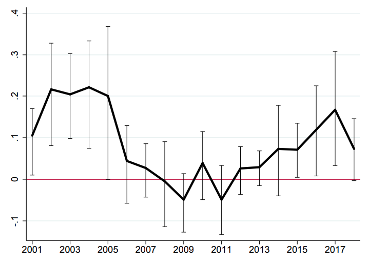

exclude: true
```{r setup}
if (!require("pacman")) install.packages("pacman")
pacman::p_load(
  tidyverse, xaringanExtra, rlang, patchwork, nycflights13, ggthemes
)
options(htmltools.dir.version = FALSE)
knitr::opts_hooks$set(fig.callout = function(options) {
  if (options$fig.callout) {
    options$echo <- FALSE
  }
knitr::opts_chunk$set(echo = TRUE, fig.align="center")
  options
})
```
```{r xaringanExtra, echo = FALSE}
xaringanExtra::use_xaringan_extra(c("tile_view", "panelset"))

```
```{r echo=FALSE}
xaringanExtra::style_panelset(panel_tab_color_active = "red")
```

---

# Roadmap

- Can we exploit situations when we know the mechanism for treatment assignment?
  - Can we exploit situations where some units are just above some threshold to get treatment, and others are just below the threshold?
  - Do deforestation policies work?

---

class: inverse, center, middle
name: hr2021

# Regression discontinuity

<html><div style='float:left'></div><hr color='#EB811B' size=1px width=796px></html>

---

# Regression discontinuity design

Suppose we want to estimate the effect of air quality on property values

--

We have a potentially large problem: 
--
there's quite a lot of things that affect housing values that may also be correlated with air quality
--

  - wealth, temperature, density, etc
  
--

This makes $E[Y^0 | D = 1] - E[Y^0 | D = 0] \neq 0$, biasing any estimates because air quality will also pick up on these other factors that determine property values

--

Here we will understand one way we can break this bias by exploiting .hi-red[discontinuities]

---

# Regression discontinuity design

The Clean Air Act mandates a set of National Ambient Air Quality Standards (NAAQS)

--

The NAAQS require counties to keep ambient air concentrations of six pollutants below some (arbitrary-ish) threshold

--

If a county goes above one of these thresholds, call them $c_0$, it is deemed to be in .hi-red[non-attainment]

---

# Regression discontinuity design

Non-attainment counties then face more stringent regulatory oversight and take up a host of actions aimed at reducing pollution back down to acceptable levels

--

Non-attainment counties had .hi-red[much] greater pollution reductions during the 1970s and 1980s compared to attainment counties (Chay and Greenstone, 2005)

---

# Regression discontinuity design

The NAAQS generate a .hi-red[discontinuity:] 
--
counties just above the threshold in some year $T$ face greater pressure to reduce pollution in subsequent years $T+1, T+2, \dots$ compared to counties just below the threshold

--

In the absence of this policy we might expect counties with $c_0 + \epsilon$ levels of pollution to be similar to counties with $c_0 - \epsilon$ in terms of .hi-blue[all other factors] (on average)
  - i.e. $E[Y^0 | D = 1] - D[Y^0 | D = 0] = 0$

--

Thus any differences in property values is likely due to the NAAQS-induced decline in pollution in non-attainment counties

---

# Regression discontinuity design

This is the essence of the .hi-blue[regression discontinuity design (RDD)]

--

Two counties with high vs low pollution are generally not comparable (e.g. high pollution areas have other disamenities, lower wealth)

--

What if instead of comparing the two whole groups we did the following

--

Compare two counties that have *virtually identical* levels of pollution,
--
 but 
--
where one is *just* above a threshold that forces it to significantly reduce pollution, and the other is *just* the below the threshold

--

The subsequent difference in other outcomes we may consider .hi-red[as good as random]

---

# Regression discontinuity design

RDD is appropriate whenever a observational unit's assignment to treatment $D$ .hi[jumps] in probability when some other variable $X$, called the running variable, is above some threshold $c_0$

--

This makes sense right?

--

Jumps are relatively unnatural, things typically change smoothly

--

In RDD the jump is the chance of being put into treatment (in our example, under more regulatory scrutiny)

---

# Regression discontinuity design

With RDD we use our knowledge about how counties are selected into treatment (by going above the threshold $c_0$) in order to estimate the average treatment effect

--

More precisely: we compare units just below to just above $c_0$ to estimate something called a .hi-blue[local average treatment effect (LATE)]

--

The .hi-blue[local] is because the estimate is only a valid ATE for units that have pollution levels near the threshold $c_0$

--

Here's what we're doing in pictures

---

# Regression discontinuity design: graphs

```{r}
set.seed(12345)
late <- 0 # local average treatment effect
n_obs <- 1000 # number of observations
rdd_df <- tibble(
  state = seq(1, n_obs)) %>%  # control/untreated potential outcome
  mutate(
    X = rnorm(n(), 50, 25), # running variable
    D = X > 50,
    Y1 = 500 + late*D - 1.5*X + rnorm(n(), 0, 20)
  ) %>% 
  filter(X > 0) %>% 
  select(
    state, D, X, Y1
  )
```

---

# Regression discontinuity design: graphs

.pull-left[

```{r rdd_base, echo = FALSE, fig.show = 'hide', warning = F, fig.width = 8}
ggplot(rdd_df) +
  geom_point(aes(x = X, y = Y1, color = D, shape = D), size = 1) +
  geom_vline(xintercept = 50, color = "grey55", linetype = "dashed") +
  geom_smooth( aes(x = X, y = Y1, color = D), 
               se = FALSE, 
               method = lm,
               formula = y ~ x) +
  annotate("text", size = 8, label = "Attainment", x = 25, y = 300) +
  annotate("text", size = 8, label = "Non-Attainment", x = 85, y = 300) +
  scale_color_colorblind() +
  theme_minimal() +
  labs(
    x = "Current Pollution (X)",
    y = "Future Housing Values (Y1)",
    title = "The relationship without the NAAQS"
  ) +
  theme(
    legend.position = "none",
    title = element_text(size = 24),
    axis.text.x = element_text(size = 24), axis.text.y = element_text(size = 24),
    axis.title.x = element_text(size = 24), axis.title.y = element_text(size = 24),
    panel.grid.minor.x = element_blank(), panel.grid.minor.y = element_blank(),
    panel.grid.major.x = element_blank(),
    panel.background = element_rect(fill = "#eeeeee", colour = NA),
    plot.background = element_rect(fill = "#eeeeee", colour = NA),
    axis.line = element_line(colour = "black")
  ) 
```

`)


]

.pull-right[

Suppose the pollution threshold is at 50

In the absence of the NAAQS, we expect a smooth/continuous transition in housing values above vs below the threshold

Next, suppose we implement the NAAQS

]


---

# Regression discontinuity design: graphs

```{r}
set.seed(12345)
late <- 40 # local average treatment effect (NOW 40)
n_obs <- 1000 # number of observations
rdd_df <- tibble(
  state = seq(1, n_obs)) %>%  # control/untreated potential outcome
  mutate(
    X = rnorm(n(), 50, 25), # running variable
    D = X > 50,
    Y1 = 500 + late*D - 1.5*X + rnorm(n(), 0, 20)
  ) %>% 
  filter(X > 0) %>% 
  select(
    state, D, X, Y1
  )
```

---

# Regression discontinuity design: graphs

.pull-left[

```{r rdd_naaqs, echo = FALSE, fig.show = 'hide', warning = F, fig.width = 8}
ggplot(rdd_df) +
  geom_point(aes(x = X, y = Y1, color = D, shape = D), size = 1) +
  geom_vline(xintercept = 50, color = "grey55", linetype = "dashed") +
  geom_smooth( aes(x = X, y = Y1, color = D), 
               se = FALSE, 
               method = lm,
               formula = y ~ x) +
  annotate("text", size = 8, label = "Attainment", x = 25, y = 300) +
  annotate("text", size = 8, label = "Non-Attainment", x = 85, y = 300) +
  annotate("segment", x = 51, xend = 51, 
           y = 425, yend = 465,
           linetype = "solid", size = 2, color = "red") +
  annotate("segment", x = 51, xend = 100, 
           y = 445, yend = 445,
           linetype = "solid", size = 2, color = "red") +
  annotate("text", size = 8, label = "LATE", x = 110, y = 445, color = "red") +
  scale_color_colorblind() +
  theme_minimal() +
  labs(
    x = "Current Pollution (X)",
    y = "Future Housing Values (Y1)",
    title = "The relationship the NAAQS"
  ) +
  theme(
    legend.position = "none",
    title = element_text(size = 24),
    axis.text.x = element_text(size = 24), axis.text.y = element_text(size = 24),
    axis.title.x = element_text(size = 24), axis.title.y = element_text(size = 24),
    panel.grid.minor.x = element_blank(), panel.grid.minor.y = element_blank(),
    panel.grid.major.x = element_blank(),
    panel.background = element_rect(fill = "#eeeeee", colour = NA),
    plot.background = element_rect(fill = "#eeeeee", colour = NA),
    axis.line = element_line(colour = "black")
  ) 
```

`)


]

.pull-right[

The policy induced greater pollution reductions in the non-attainment counties

Housing prices shift up for those counties

The vertical distance between the two groups at 50 is our .hi-blue[local average treatment effect]

]

---

# Regression discontinuity design: the data

We've seen what RDDs look like, what do we need to do one?

--

RDD is about finding these .hi[jumps] in the probability of treatment as we move along some other variable $X$

--

How do we find these jumps?

--

For environmental topics they're often embedded in rules (e.g. the NAAQS), or across space (e.g. deforestation policy)

---

# Regression discontinuity design: the data

Good and plausible RDDs often involve $X$s having a 'hair trigger' that's not tightly related to the outcome
  - e.g. being 10 meters on either side of the Bolivia/Brazil border is pretty arbitrary in the grand scheme of things, but a massive discontinuity in deforestation policy
  
--

We will need to be focused on the area right around this hair trigger threshold: that means we will need a lot of data near $c_0$ in order to have precise estimates of the LATE

---

# Regression discontinuity design: the types

There are two classes of RDD: sharp and fuzzy

--

.hi-blue[Sharp designs] are where the probability of treatment increases from 0 to 1 at the threshold $c_0$

--

.hi-red[Fuzzy designs] are where the probability of treatment increases discontinuously at $c_0$, but not necessarily from 0 to 1

--

We will be focusing on sharp designs to keep it simple

---

# Sharp RDD: set up

A sharp RDD has treatment $D$ being a deterministic function of the running variable $X$
  - e.g. deforestation policy is a deterministic function of distance from the Bolivia-Brazil border
  
--

In a sharp RDD treatment is given by:
\begin{align}
D_i = 
\begin{cases} 
      1 & X_i \geq c_0 \\
      0 & X_i < c_0
   \end{cases}
\end{align}

If we know $X_i$ we know treatment with certainty

---

# Sharp RDD: set up


In potential outcomes terms we then have:
$$Y^0_i = \alpha + \beta X_i \\
Y^1_i = Y^0_i + \delta$$

--

Which gives us our regression is:
\begin{align}
  Y_i &= D_i Y^1_i + (1- D_i) Y^0_i \tag{Rubin model} \\
  Y_i &= Y^0_i + (Y^1_i - Y^0_i)D_i \tag{Rearranged} \\
  Y_i &= \alpha + \beta X_i + \delta D_i + \underbrace{\varepsilon_i}_{\text{Error}} \tag{Plug in above terms}
\end{align}

--

What is the mathematical definition of $\delta$?

---

# Sharp RDD: treatment effects

$\delta$ is the discontinuity in the .hi[conditional expectation function:]

--

\begin{align}
  \delta =& \lim_{X_i \rightarrow c_0} E[Y^1_i | X_i = c_0] - \lim_{c_0 \leftarrow X_i} E[Y^0_i | X_i = c_0] \\
  =& \lim_{X_i \rightarrow c_0} E[Y_i | X_i = c_0] - \lim_{c_0 \leftarrow X_i} E[Y_i | X_i = c_0]
\end{align}

--

The sharp RDD gives us an average causal effect of treatment .hi-blue[at the discontinuity,] which is why it is called a local average treatment effect (LATE):
$$\delta_{SRDD} = E[Y_i^1 - Y^0_i | X_i = c_0]$$

---

# Sharp RDD: treatment effects

.pull-left[


```{r, echo = FALSE, warning = F, fig.width = 8}
ggplot(rdd_df) +
  geom_point(aes(x = X, y = Y1, color = D, shape = D), size = 1) +
  geom_vline(xintercept = 50, color = "grey55", linetype = "dashed") +
  geom_smooth( aes(x = X, y = Y1, color = D), 
               se = FALSE, 
               method = lm,
               formula = y ~ x) +
  geom_smooth(data = rdd_df %>% filter(D == TRUE),
              aes(x = X - 50, y = Y1 + 75, color = D), 
               se = FALSE, 
               method = lm,
               formula = y ~ x,
              linetype = 'dashed') +
  geom_smooth(data = rdd_df %>% filter(D == FALSE),
              aes(x = X + 50, y = Y1 - 75, color = D), 
               se = FALSE, 
               method = lm,
               formula = y ~ x,
              linetype = 'dashed') +
  annotate("text", size = 8, label = "Attainment", x = 25, y = 300) +
  annotate("text", size = 8, label = "Non-Attainment", x = 85, y = 300) +
  scale_color_colorblind() +
  theme_minimal() +
  labs(
    x = "Current Pollution (X)",
    y = "Future Housing Values (Y1)",
    title = "The relationship the NAAQS"
  ) +
  theme(
    legend.position = "none",
    title = element_text(size = 24),
    axis.text.x = element_text(size = 24), axis.text.y = element_text(size = 24),
    axis.title.x = element_text(size = 24), axis.title.y = element_text(size = 24),
    panel.grid.minor.x = element_blank(), panel.grid.minor.y = element_blank(),
    panel.grid.major.x = element_blank(),
    panel.background = element_rect(fill = "#eeeeee", colour = NA),
    plot.background = element_rect(fill = "#eeeeee", colour = NA),
    axis.line = element_line(colour = "black")
  ) 
```

]


.pull-right[
Notice that .hi[extrapolation] plays a key role: there is no $X$ where we have some units with $D_i = 1$ and others with $D_i = 0$

We are extrapolating (locally around $c_0$) using the dashed lines to estimate the difference in the two means

]

---

# Sharp RDD: identifying assumption

The identifying assumption for RDD is called the .hi-blue[continuity assumption:]
> $E[Y^0_i|X = c_0]$ and $E[Y^1_i|X = c_0]$ are continuous (smooth) in $X$ at $c_0$

It means that the expected potential outcomes should remain continuous at the threshold in the absence of treatment: they would not have jumped

--

If this is true, then all other determinants of $Y$ are thus continuously related to $X$ and the jump is completely due to treatment

---

class: inverse, center, middle
name: hr2021

# The Brazilian Amazon’s Double Reversal of Fortune

<html><div style='float:left'></div><hr color='#EB811B' size=1px width=796px></html>


---

# What is the paper about?

What is Burgess et al. (2019) (.hi[BCO]) about?

--

BCO aims to estimate the .hi-red[causal] effect of deforestation regulation in Brazil

--

Why is this important?

--

1. The Amazon rainforest is incredibly important
--

2. The Amazon is largely undeveloped, unclear if deforestation regulation can be adequately enforced to matter
--

3. Understanding whether the regulation works is important for future policy

---

# How does the paper do it?

BCO estimate the causal effect of Brazil's deforestation policy by exploiting a spatial discontinuity

--

BCO does this using a RDD variant called .hi-blue[spatial RDD]

--

They compare deforestation outcomes in Brazil, to those in other countries, close to the country border

---

# How does the paper do it?

<div style= "float:right;position: relative;">
```{r, out.width = "575px", echo = FALSE}
knitr::include_graphics("figures/border.png")
```
</div>

Bolivia is on the left, Brazil is on the right

--

Darker green is more forested

--

Red is protected, blue is private

--

Sharp discontinuities in forest cover are very clear all along the border (black)

---

# How does the paper do it?

In the spatial RDD the running variable $X$ is distance from the border
  - Negative values for other countries, positive values for Brazil

--

Their model is similar to what we just went over with sharp RDD:
$$Y_i = \delta \text{Brazil}_i + f(\text{distance to border}_i) + \text{controls} + \varepsilon_i$$

Here:
- $\text{Brazil}_i \equiv D_i$
- $f(\text{distance to border}_i) \equiv X_i$

---

# How does the paper do it?

The paper also includes a set of controls for things that may be different/discontinuous across the border (e.g. national infrastructure, elevation, etc)

--

BCO's key assumption is that other factors that affect deforestation change smoothly across the border

--

This is likely reasonable: the borders were arbitrarily set in 1750 when the area was virtually unexplored: where the border is .hi-blue[locally] is effectively random

--

They also find no discontinuities in other things that may be important for deforestation: roads, slope, distance to cities, etc

---

# What they get

The forest data are very, very large (120 meter pixels!) so we won't be doing this hands on

---

# What they get

<div style= "float:right;position: relative;">
```{r, out.width = "575px", echo = FALSE}
knitr::include_graphics("figures/linear_rdd.png")
```
</div>

0 is the border, to the right is Brazil, to the left is other countries, the year is 2000

--

Other countries have greater forest cover than Brazil, but with a slight decline as you move to the Brazil border

--

Brazil has discontinuously lower forest cover near the border

---

# What they get


<div style= "float:right;position: relative;">
```{r, out.width = "575px", echo = FALSE}

```
</div>

BCO also runs the RDD year-by-year so we can see how the LATE changes over time

--

The effect of being in Brazil goes to zero for about 2006-2014

--

This is about when Brazil implemented tougher national deforestation policies: *Action Plan for the Prevention and Control of Deforestation in the Legal Amazon, Law on Public Forest Management, etc*

---

# What they get: deforestation LATE by year


<div style= "float:right;position: relative;">
```{r, out.width = "575px", echo = FALSE}

```
</div>

The effect of the tougher policies seems to have gone away after 2014

--

Why?

--

Economic crises decreased enforcement of environmental regulations, and lead to weakening of the regulations
