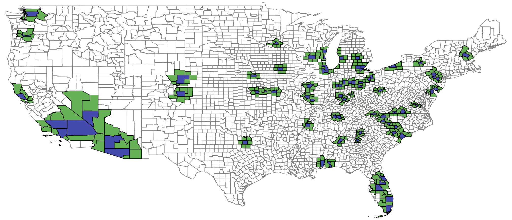

exclude: true
```{r setup}
if (!require("pacman")) install.packages("pacman")
pacman::p_load(
  tidyverse, xaringanExtra, rlang, patchwork, nycflights13
)
options(htmltools.dir.version = FALSE)
knitr::opts_hooks$set(fig.callout = function(options) {
  if (options$fig.callout) {
    options$echo <- FALSE
  }
knitr::opts_chunk$set(echo = TRUE, fig.align="center")
  options
})
```
```{r xaringanExtra, echo = FALSE}
xaringanExtra::use_xaringan_extra(c("tile_view", "panelset", "webcam"))

```
```{r echo=FALSE}
xaringanExtra::style_panelset(panel_tab_color_active = "red")
```

---

# Roadmap

- How do we estimate a treatment effect when the treated and control groups do not (counterfactually) look the same in the cross-section?
- What is the mortality cost of lead?


---

class: inverse, center, middle
name: dd

# Difference-in-differences

<html><div style='float:left'></div><hr color='#EB811B' size=1px width=796px></html>

---

# Our comparisons so far

So far we've made two kinds of comparisons to estimate treatment effects:

1. Comparing two groups with random assignment to treatment .hi[(RCT)]
--

2. Comparing two groups where there is a local discontinuity (i.e. discrete change) in policy .hi[(regression discontinuity)]

--

In both of these we are comparing groups in the .hi-blue[cross-section]: there is no concept of time, before and after a policy was enacted, etc

---

# Our comparisons so far

The key assumption for these comparisons is that the treated group would have looked the same as the control group (i.e. had the same outcomes) in the absence of treatment

--

This assumption is often hard to defend<sup>1</sup>

.footnote[
One way people show that this tends to not be true is to throw in a bunch of extra controls into the regression, if this affects your estimates it indicates there's likely a problem with the assumption.
]

--

Let's try to relax this assumption by exploiting .hi-blue[temporal comparisons] in addition to the cross-sectional comparison

---

# Difference-in-differences

One way to describe our comparisons thus far is as .hi-red[differences]

--

The estimated effect of a policy is simply the difference in mean outcomes between treated and control groups:
$$\delta = E[Y^1|D=1] - E[Y^0|D=0]$$

---

# Difference-in-differences

Our next method is called .hi-blue[difference-in-differences] (DD)

--

What DD does is take the difference of two comparisons in three steps:
--

1. Take the difference in mean outcomes between treated and control .hi-red[before] treatment
--

2. Take the difference in mean outcomes between treated and control .hi-red[after] treatment
--

3. Take the difference between 1 and 2

--

The name comes from the fact that we are taking the difference (3) between two differences (1 and 2)

---

# Difference-in-differences

Why do we use DD?

--

The identifying assumption required is less strict than for difference approaches

--

.hi[**DD assumption:**] the treatment and control group would have followed .hi-blue[parallel trends] in the absence of treatment
- i.e. the difference in outcomes would have remained constant

--

This is much less stringent than requiring the outcomes to have been the same in the absence of treatment

---

# Difference-in-differences

.hi-red[Example:] Suppose we want to understand the effect of a conservation policy passed in New York on biodiversity

--

Suppose also that:
- The effect of the New York policy is given by .hi[B]
- Each state has it's own fixed determinants of biodiversity (e.g. land cover, average temperature, etc) given by .hi[NY, PA, MA, etc]
- Each period has it's own determinants of biodiversity, common across all states (e.g. federal policy, global climate change) given by .hi[T<sub>0</sub>, T<sub>1</sub>], where 0 is years before the policy is passed, and 1 is after

---

# Difference-in-differences

When we observe data on biodiversity we see the combination of all determinants: .hi[B + NY + T], not just .hi[B]

--

We want to find a way to recover **only** .hi[E[B]]

--

There are two ways you could think about trying to estimate .hi[B] using differences:

1. Compare New York to another state after the policy is passed
--

2. Compare New York to itself, before and after the policy is passed

---

# The cross-sectional difference

Let's compare New York to another state, Pennsylvania

--

If we were to do this with differences we would get an estimate of .hi[B] given by: 
<center>
  .hi[(B + NY + T<sub>1</sub>) - (PA + T<sub>1</sub>) = B + NY - PA]
</center>

--

This is not .hi[B]!

--

Why?

---

# The cross-sectional difference

<center>
  .hi[(B + NY + T<sub>1</sub>) - (PA + T<sub>1</sub>) = B + NY - PA]
</center>

There are other determinants of biodiversity that are different across New York and Pennsylvania that are .hi-blue[not] the policy: landcover, urbanization, pollution, etc

--

If we take a simple difference across states, we can't disentangle whether the difference is due to the policy .hi[B] or differences in these other factors .hi[NY - PA]


---

# The time series difference

The next logical thing to try to circumvent this problem is to compare New York to itself, before .hi[NY + T<sub>0</sub>] and after .hi[B + NY + T<sub>1</sub>] the policy

--

<center>
  .hi[(B + NY + T<sub>1</sub>) - (NY + T<sub>0</sub>) = B + T<sub>1</sub> - T<sub>0</sub>]
</center>

--

This is not .hi[B]!

--

Why?


---

# The time series difference

<center>
  .hi[(B + NY + T<sub>1</sub>) - (NY + T<sub>0</sub>) = B + T<sub>1</sub> - T<sub>0</sub>]
</center>

There are other determinants of biodiversity that are different before and after the policy that are .hi-blue[not] the New York policy: federal policy changes, trends in urbanization and pollution

--

If we take a simple difference over time, we can't disentangle whether the difference is due to the policy .hi[B] or differences in other factors that are changing over time .hi[T<sub>1</sub> - T<sub>0</sub>]

---

# Difference-in-differences

With DD we .hi-blue[combine] these two differences

--

We take the time series differences for NY and PA:


|              |        After        |           Before           |                                Time Series Difference                               |
|:------------:|:-------------------:|:--------------------------:|:-----------------------------------------------------------------------------------:|
|   New York   | B + NY + T<sub>1</sub> |   NY + T<sub>0</sub>   | (B + NY + T<sub>1</sub>) - (B + NY + T<sub>1</sub>) = .hi[B + T<sub>1</sub> - T<sub>0</sub>] |
| Pennsylvania |  PA + T<sub>1</sub> |     PA + T<sub>0</sub>     |  (PA + T<sub>1</sub>) - (PA + T<sub>0</sub>) = .hi[T<sub>1</sub> - T<sub>0</sub>]  |

--

Next,  difference the time series differences to get the DD<sup>1</sup>

.footnote[
<sup>1</sup>You can also difference in the opposite order and end up with the same result
]


---

# Difference-in-differences


|              |        After        |           Before           |                                Time Series Difference                               |
|:------------:|:-------------------:|:--------------------------:|:-----------------------------------------------------------------------------------:|
|   New York   | B + NY + T<sub>1</sub> |  NY + T<sub>0</sub>   | (B + NY + T<sub>1</sub>) - (B + NY + T<sub>1</sub>) = .hi[B + T<sub>1</sub> - T<sub>0</sub>] |
| Pennsylvania |  PA + T<sub>1</sub> |     PA + T<sub>0</sub>     |  (PA + T<sub>1</sub>) - (PA + T<sub>0</sub>) = .hi[T<sub>1</sub> - T<sub>0</sub>]  |
|              |                     |                            |                                                                                     |
|              |                     |                            |                                                                                     |
|              |                     | Difference-in-differences: |                .hi[(B + T<sub>1</sub> - T<sub>0</sub>) - (T<sub>1</sub> - T<sub>0</sub>) = B      ]                                    |

--

The time series differences lets us control for all fixed determinants within a state (.hi[NY])

--

The cross-sectional difference lets us control for all period-specific determinants common across all states (.hi[T<sub>1</sub>])

--

Combining these two differences addresses both and lets us recover .hi[B], the true effect of the policy!

---

# Difference-in-differences

Note that DD is not magic

--

It only can address determinants of biodiversity that are either:
1. Time-invariant
2. Time-varying, but common across all states

--

If there is a determinant of biodiversity that is varying over time, and differentially across states, DD will fail to correctly estimate .hi[B]
- State climate trends, state pollution trends, etc

---

# Difference-in-differences

Suppose that there is another determinant of biodiversity .hi[C<sup>NY</sup><sub>1</sub>, C<sup>NY</sup><sub>0</sub>] that only occurs in New York and varies over time
- e.g. climate in New York relative to Pennsylvania

Our DD is then

|              |        After        |           Before           |                                Time Series Difference                               |
|:------------:|:-------------------:|:--------------------------:|:-----------------------------------------------------------------------------------:|
|   New York   | B + NY + T<sub>1</sub> + C<sup>NY</sup><sub>1</sub> + C<sup>NY</sup><sub>0</sub> |  NY + T<sub>0</sub>   | (B + NY + T<sub>1</sub>) - (B + NY + T<sub>1</sub>) = .hi[B + T<sub>1</sub> - T<sub>0</sub> + C<sup>NY</sup><sub>1</sub>- C<sup>NY</sup><sub>0</sub>] |
| Pennsylvania |  PA + T<sub>1</sub> |     PA + T<sub>0</sub>     |  (PA + T<sub>1</sub>) - (PA + T<sub>0</sub>) = .hi[T<sub>1</sub> - T<sub>0</sub>]  |
|              |                     |                            |                                                                                     |
|              |                     |                            |                                                                                     |
|              |                     | Difference-in-differences: |                .hi[(B + T<sub>1</sub> - T<sub>0</sub>) - (T<sub>1</sub> - T<sub>0</sub>) = B + C<sup>NY</sup><sub>1</sub>- C<sup>NY</sup><sub>0</sub>      ]                                    |

---

# Difference-in-differences

|              |        After        |           Before           |                                Time Series Difference                               |
|:------------:|:-------------------:|:--------------------------:|:-----------------------------------------------------------------------------------:|
|   New York   | B + NY + T<sub>1</sub> + C<sup>NY</sup><sub>1</sub> + C<sup>NY</sup><sub>0</sub> |  NY + T<sub>0</sub>   | (B + NY + T<sub>1</sub>) - (B + NY + T<sub>1</sub>) = .hi[B + T<sub>1</sub> - T<sub>0</sub> + C<sup>NY</sup><sub>1</sub>- C<sup>NY</sup><sub>0</sub>] |
| Pennsylvania |  PA + T<sub>1</sub> |     PA + T<sub>0</sub>     |  (PA + T<sub>1</sub>) - (PA + T<sub>0</sub>) = .hi[T<sub>1</sub> - T<sub>0</sub>]  |
|              |                     |                            |                                                                                     |
|              |                     |                            |                                                                                     |
|              |                     | Difference-in-differences: |                .hi[(B + T<sub>1</sub> - T<sub>0</sub>) - (T<sub>1</sub> - T<sub>0</sub>) = B + C<sup>NY</sup><sub>1</sub>- C<sup>NY</sup><sub>0</sub>      ]                                    |

DD cannot isolate the effect of .hi[B] versus .hi[C<sup>NY</sup><sub>1</sub>- C<sup>NY</sup><sub>0</sub>]

There cannot be any (uncontrolled for) time varying differences between NY and PA if we want to correctly estimate .hi[B]

---

# Difference-in-differences: to the data

Now lets see how this works in practice: [notebook here](https://raw.githack.com/irudik/aem6510/master/lecture-notes/13-health-dd/13-health-dd-notebook.html)

--

What we are going to do is create a fake dataset where we .hi-blue[know the true value of what we want to estimate]

--

This is a good skill to practice to make sure you understand methods and that your code works correctly


---
exclude: true
```{r, echo = FALSE, results = 'hide'}
# load required packages
if (!require("pacman")) install.packages("pacman")
pacman::p_load(
  ggthemes, fixest, broom, tidyverse
)

########################################
# Initialize RNG
set.seed(12345)

########################################
## Initialize data generating parameters

# Fixed state characteristics: ny has more biodiversity
state_fes <- tribble(~state, ~state_fe,
                     "NY", 88,
                     "PA", 44)

# Period characteristics: biodiversity is declining
period_fes <- tribble(~period, ~period_fe,
                     "before", 341,
                     "after", 207)

# True effect of the policy: how many additional species are saved?
treatment_effect <- 55

########################################
## Generate fake data

# Create data frame
bio_df <- crossing(
  state = c("NY", "PA"),
  period = c("before", "after"),
  obs = 1:1000
) %>%
  left_join(period_fes) %>% 
  left_join(state_fes) %>% 
  mutate(treated = state == "NY" & period == "after",
         period = factor(period, levels = c("before", "after"))) %>% 
  arrange(state, period) %>% 
  mutate(
    biodiversity = ifelse(
      treated,
      period_fe + state_fe + treatment_effect + 50*rnorm(n()),
      period_fe + state_fe  + 50*rnorm(n())
    )
  ) %>% 
  group_by(state, period) %>% 
  mutate(mean_biodiversity = mean(biodiversity)) %>% 
  ungroup()

bio_df$period = factor(bio_df$period, levels = c("before", "after"))

seg_df <- bio_df %>% 
  group_by(state, period) %>% 
  summarise(mean_biodiversity = mean(biodiversity))

diff <- 
  filter(seg_df, 
         period == 'after',
         state =='PA')$mean_biodiversity[1] - 
  filter(seg_df, 
         period =='before', 
         state =='PA')$mean_biodiversity[1]


dffull <- rbind(
  #Step 1: Raw data only
  bio_df %>% mutate(msg = '1. Start with raw data.', msg_idx = 1),
  #Step 2: Add Y-lines
  bio_df %>% mutate(msg = '2. Figure out what differences in Y are explained by Treatment and/or Time.', msg_idx = 2),
  #Step 3: Collapse to means
  bio_df %>% mutate(biodiversity = mean_biodiversity, msg = "3. Keep only what's explained by Treatment and/or Time.", msg_idx = 3),
  #Step 4: Display time effect
  bio_df %>% mutate(biodiversity = mean_biodiversity, msg = "4. See how Control changed over Time.", msg_idx = 4),
  #Step 5: Shift to remove time effect
  bio_df %>% mutate(biodiversity = mean_biodiversity - (period == 'after')*diff,
                    biodiversity = biodiversity - min(biodiversity),
                msg = "5. Remove the Before/After Control difference for both groups.", msg_idx = 5),
  #Step 6: Raw demeaned data only
  bio_df %>% mutate(biodiversity = mean_biodiversity - (period == 'after')*diff,
                    biodiversity = biodiversity - min(biodiversity),
                msg = '6. The remaining Before/After Treatment difference is the effect.', msg_idx = 6) %>% 
    filter(state == "NY") %>% 
    mutate(biodiversity = biodiversity - min(biodiversity)))

dffull$period <- factor(dffull$period,
                        levels = c("before", "after"))


```


---

# DD step 1

```{r dd1, echo = FALSE, fig.show = 'hide', warning = F, fig.height = 8, fig.width = 12}
ggplot(bio_df, group = interaction(state, period)) +
  geom_jitter(aes(x = period, y = biodiversity, color = interaction(state), shape = interaction(state)), size = 3) +
  annotate("text", size = 8, label = "NY", x = 1, y = 500) +
  annotate("text", size = 8, label = "PA", x = 1, y = 100, color = "orange") +
  scale_color_colorblind() +
  theme_minimal() +
  scale_x_discrete(labels = c("Before Treatment", "After Treatment")) +
  scale_y_continuous(limits = c(50, 500)) +
  labs(
    x = "Time",
    y = "Biodiversity",
    title = "Start with the raw data"
  ) +
  theme(
    legend.position = "none",
    title = element_text(size = 24),
    axis.text.x = element_text(size = 24), axis.text.y = element_text(size = 24),
    axis.title.x = element_text(size = 24), axis.title.y = element_text(size = 24),
    panel.grid.minor.x = element_blank(), panel.grid.minor.y = element_blank(),
    panel.grid.major.x = element_blank(),
    panel.background = element_rect(fill = "#eeeeee", colour = NA),
    plot.background = element_rect(fill = "#eeeeee", colour = NA),
    axis.line = element_line(colour = "black")
  )

```

`)

---

# DD step 2

```{r dd2, echo = FALSE, fig.show = 'hide', warning = F, fig.height = 8, fig.width = 12}
ggplot(dffull, group = interaction(state, period)) +
  geom_jitter(aes(x = period, y = mean_biodiversity, color = interaction(state), shape = interaction(state)), size = 3, height = 0) +
  scale_color_colorblind() +
  theme_minimal() +
  scale_x_discrete(labels = c("Before Treatment", "After Treatment")) +
  scale_y_continuous(limits = c(50, 500)) +
  labs(
    x = "Time",
    y = "Biodiversity",
    title = "Take the mean of each state-period"
  ) +
  theme(
    legend.position = "none",
    title = element_text(size = 24),
    axis.text.x = element_text(size = 24), axis.text.y = element_text(size = 24),
    axis.title.x = element_text(size = 24), axis.title.y = element_text(size = 24),
    panel.grid.minor.x = element_blank(), panel.grid.minor.y = element_blank(),
    panel.background = element_rect(fill = "#eeeeee", colour = NA),
    plot.background = element_rect(fill = "#eeeeee", colour = NA),
    panel.grid.major.x = element_blank(),
    axis.line = element_line(colour = "black")
  )

```

`)


---

# DD step 3

```{r dd3, echo = FALSE, fig.show = 'hide', warning = F, fig.height = 8, fig.width = 12}

ggplot(dffull %>% filter(msg_idx == 4), group = interaction(state, period)) +
  geom_jitter(aes(x = period, y = biodiversity, color = interaction(state), shape = interaction(state)), size = 3, height = 0) +
  annotate("segment", x = 1.45, xend = 1.45, y = seg_df$mean_biodiversity[1], yend = seg_df$mean_biodiversity[2],
           size = 1, color = "black") +
  annotate("segment", x = 1.55, xend = 1.55, y = seg_df$mean_biodiversity[3], yend = seg_df$mean_biodiversity[4],
           size = 1, color = "orange") +
  scale_color_colorblind() +
  theme_minimal() +
  scale_x_discrete(labels = c("Before Treatment", "After Treatment")) +
  scale_y_continuous(limits = c(50, 500)) +
  labs(
    x = "Time",
    y = "Biodiversity",
    title = "Here are the differences in means for NY and PA"
  ) +
  theme(
    legend.position = "none",
    title = element_text(size = 24),
    axis.text.x = element_text(size = 24), axis.text.y = element_text(size = 24),
    axis.title.x = element_text(size = 24), axis.title.y = element_text(size = 24),
    panel.grid.minor.x = element_blank(), panel.grid.minor.y = element_blank(),
    panel.background = element_rect(fill = "#eeeeee", colour = NA),
    plot.background = element_rect(fill = "#eeeeee", colour = NA),
    panel.grid.major.x = element_blank(),
    axis.line = element_line(colour = "black")
  )
```

`)


---

# DD step 4

```{r dd4, echo = FALSE, fig.show = 'hide', warning = F, fig.height = 8, fig.width = 12}
ggplot(dffull %>% filter(msg_idx == 5), group = interaction(state, period)) +
  geom_jitter(aes(x = period, y = biodiversity, color = interaction(state), shape = interaction(state)), size = 3, height = 0) +
  scale_color_colorblind() +
  theme_minimal() +
  scale_x_discrete(labels = c("Before Treatment", "After Treatment")) +
  labs(
    x = "Time",
    y = "Biodiversity",
    title = "Difference out how the control changed over time (first diff)"
  ) +
  theme(
    legend.position = "none",
    title = element_text(size = 24),
    axis.text.x = element_text(size = 24), axis.text.y = element_text(size = 24),
    axis.title.x = element_text(size = 24), axis.title.y = element_text(size = 24),
    panel.grid.minor.x = element_blank(), panel.grid.minor.y = element_blank(),
    panel.background = element_rect(fill = "#eeeeee", colour = NA),
    plot.background = element_rect(fill = "#eeeeee", colour = NA),
    panel.grid.major.x = element_blank(),
    axis.line = element_line(colour = "black")
  )
```

`)


---

# DD step 5

```{r dd5, echo = FALSE, fig.show = 'hide', warning = F, fig.height = 8, fig.width = 12}
ggplot(dffull %>% filter(msg_idx == 5), group = interaction(state, period)) +
  geom_jitter(aes(x = period, y = biodiversity, color = interaction(state), shape = interaction(state)), size = 3, height = 0) +
  scale_color_colorblind() +
  theme_minimal() +
  scale_x_discrete(labels = c("Before Treatment", "After Treatment")) +
  labs(
    x = "Time",
    y = "Biodiversity",
    title = "The black lines each represent a difference"
  ) +
  theme(
    legend.position = "none",
    title = element_text(size = 24),
    axis.text.x = element_text(size = 24), axis.text.y = element_text(size = 24),
    axis.title.x = element_text(size = 24), axis.title.y = element_text(size = 24),
    panel.grid.minor.x = element_blank(), panel.grid.minor.y = element_blank(),
    panel.background = element_rect(fill = "#eeeeee", colour = NA),
    plot.background = element_rect(fill = "#eeeeee", colour = NA),
    panel.grid.major.x = element_blank(),
    axis.line = element_line(colour = "black")
  )
```

`)


---

# DD step 6

```{r dd6, echo = FALSE, fig.show = 'hide', warning = F, fig.height = 8, fig.width = 12}
ggplot(dffull %>% filter(msg_idx == 6), group = interaction(state, period)) +
  geom_jitter(aes(x = period, y = biodiversity, color = interaction(state), shape = interaction(state)), size = 3, height = 0) +
  annotate("segment", x = 1.5, xend = 1.5, y = 0, yend = treatment_effect,
           size = 1, color = "red") +
  annotate("text", size = 8, label = paste0("True treatment effect size = ", treatment_effect), x = 1, y = treatment_effect/2, color = "red") +
  scale_color_colorblind() +
  theme_minimal() +
  scale_x_discrete(labels = c("Before Treatment", "After Treatment")) +
  labs(
    x = "Time",
    y = "Biodiversity",
    title = "The remaining difference in the treatment group\nis the difference-in-differences"
  ) +
  theme(
    legend.position = "none",
    title = element_text(size = 24),
    axis.text.x = element_text(size = 24), axis.text.y = element_text(size = 24),
    axis.title.x = element_text(size = 24), axis.title.y = element_text(size = 24),
    panel.grid.minor.x = element_blank(), panel.grid.minor.y = element_blank(),
    panel.background = element_rect(fill = "#eeeeee", colour = NA),
    plot.background = element_rect(fill = "#eeeeee", colour = NA),
    panel.grid.major.x = element_blank(),
    axis.line = element_line(colour = "black")
  )
```

`)

---

class: inverse, center, middle
name: hr2021

# The effect of leaded gasoline on elderly mortality: Evidence from regulatory exemptions

<html><div style='float:left'></div><hr color='#EB811B' size=1px width=796px></html>

---

# What is the paper about?

What is Hollingsworth and Rudik (2021) (.blue[HR]) about?

--

HR aims to estimate the .hi-red[causal] effect of lead on mortality

--

Why is this important? We know lead is bad

--

1. There is little causal evidence for any effects of lead
--

2. Almost zero causal evidence for effects of lead on adults in any way
--

3. Having an accurate measure of effects/costs is vital for policymaking

---

# Environmental research directly affects policy!


---

# How does the paper do it?

HR estimates the causal effect of lead by exploiting a .hi-blue[quasi-experiment]

--

> a quasi-experiment is a real world occurance that approximates an actual RCT; quasi-experiments are also called natural experiments

--

Randomly assigning lead exposure to different groups is unethical, but we can learn from situations where real world exposure was *as good as random*

--

The quasi-experiment HR exploits is the sudden removal of lead from racing gasoline in 2007

--

Places that happened to have racetracks in 2007 had a significant decrease in lead emissions relative to places without racetracks

---

# How does the paper do it?

Here's the 2x2 DD table

|         	|                    Before                    	|                    After                    	|
|:-------:	|:--------------------------------------------:	|:-------------------------------------------:	|
| .hi[Treated] 	|   .hi[Areas near NASCAR racetracks before 2007]   	|   .hi[Areas near NASCAR racetracks after 2007 ]  	|
| Control 	| Areas far from NASCAR racetracks before 2007 	| Areas far from NASCAR racetracks after 2007 	|


We are comparing areas .hi[close] vs far from racetracks, before vs after deleading in 2007

---

# How does the paper do it?

Here's the 2x2 DD table

|         	|                    Before                    	|                    After                    	|
|:-------:	|:--------------------------------------------:	|:-------------------------------------------:	|
| Treated 	|   Areas near NASCAR racetracks before 2007   	|   Areas near NASCAR racetracks after 2007   	|
| .hi[Control] 	| .hi[Areas far from NASCAR racetracks before 2007] 	| .hi[Areas far from NASCAR racetracks after 2007] 	|


We are comparing areas close vs .hi[far] from racetracks, before vs after deleading in 2007

---

# How does the paper do it?

Here's the 2x2 DD table

|         	|                    .hi[Before]                    	|                    After                    	|
|:-------:	|:--------------------------------------------:	|:-------------------------------------------:	|
| Treated 	|   .hi[Areas near NASCAR racetracks before 2007]   	|   Areas near NASCAR racetracks after 2007   	|
| Control 	| .hi[Areas far from NASCAR racetracks before 2007] 	| Areas far from NASCAR racetracks after 2007 	|


We are comparing areas close vs far from racetracks, .hi[before] vs after deleading in 2007

---

# How does the paper do it?

Here's the 2x2 DD table

|         	|                    Before                    	|                    .hi[After]                    	|
|:-------:	|:--------------------------------------------:	|:-------------------------------------------:	|
| Treated 	|   Areas near NASCAR racetracks before 2007   	|   .hi[Areas near NASCAR racetracks after 2007]   	|
| Control 	| Areas far from NASCAR racetracks before 2007 	| .hi[Areas far from NASCAR racetracks after 2007] 	|


We are comparing areas close vs far from racetracks, before vs .hi[after] deleading in 2007


---

# How does the paper do it?

.blue[track/treated counties], .green[border/weak treated counties], white control counties



---

# Event studies

What HR do is actually a generalization of DD: an .hi-blue[event study]

--

An event study is basically just a DD with multiple time periods before and after the treatment

--

Here we estimate the effect of being in the treated group, relative to some baseline period
- In the 2x2 DD this baseline period was "before"

--

1. We can look at dynamic effects
--

2. It provides supporting evidence for the parallel trends assumption

---

# Event studies: dynamic effects

With an event study we can see how the effect of a policy changes *over time*

--

We will be able to estimate the effect in each post-period relative to some period

--

If we see estimates getting larger, the effect grows over time

--

If estimates get smaller, the effect shrinks


---

# Event studies: parallel pre-trends

In an event study we may have multiple periods before treatment

--

We can estimate the effect of being in the treatment group in each of these (pre-)periods

--

If there is no trend in the effect, the .hi-blue[pre-]trends are parallel

--

This gives us some comfort that the trends were likely to be parallel in the post-period in the absence of treatment

--

We never observe what would have .hi-red[actually] happened though, parallel pre-trends is just supporting evidence that the parallel trends assumption holds

---

# HR (2021): to the data

Now lets use the actual HR (2021) data to get some practice: [notebook here](https://raw.githack.com/irudik/aem6510/master/lecture-notes/13-health-dd/13-health-dd-notebook.html)

---

# HR (2021): takeaways

What can we take away from HR (2021)

1. Lead has a causal effect on elderly mortality
  - It appears to be through cardiovascular channels, perhaps *deaths of despair* as well (Case and Deaton, 2015)
2. The mortality costs are large
  - The external mortality costs imposed by NASCAR are larger than the value of all NASCAR teams combined
  - The social cost of lead is .hi-red[at least $1,000 per gram]
    - This is very, very, very big