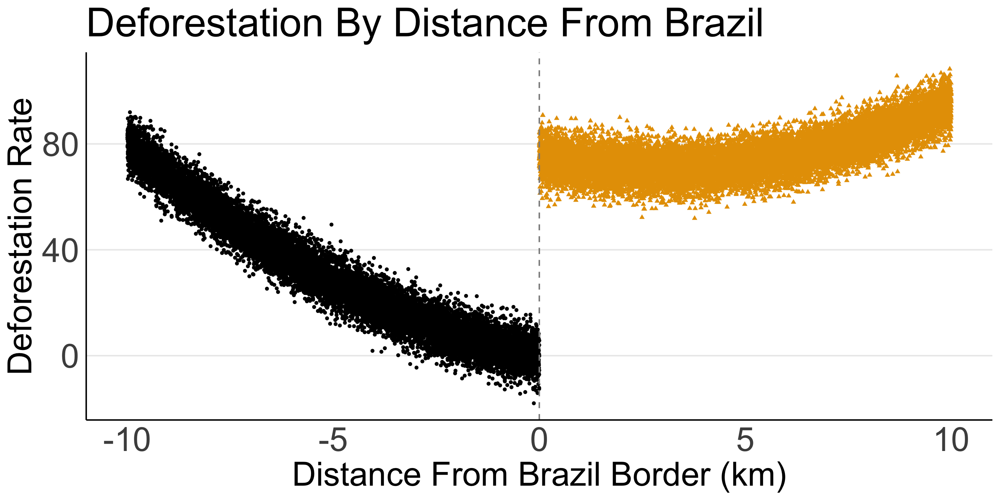

  
<style type="text/css">
  .main-container {
    max-width: 800px;
    margin-left: auto;
    margin-right: auto;
  }
</style>
  
```{r setup, include=FALSE}
knitr::opts_chunk$set(echo = TRUE, cache = TRUE, dpi = 300)
# Load packages
if (!require("pacman")) install.packages("pacman")
pacman::p_load(
  tidyverse, lubridate, tidylog
)
options("tidylog.display" = NULL)
```

In this problem set we want to understand the effect of Brazil's (lack of) deforestation policy.

Using only `tidyverse` commands and the `lm` command do the following:

1. Load the csv datasets in the `data` folder into dataframes named `rdd` and `dd`
2. The `rdd` dataset contains data on deforestation rates around the brazil border similar to the BCO paper we discussed in class. Positive values of the distance variable mean you are in Brazil, negative values mean you are in Bolivia. Using a regression discontinuity approach, what is the local average treatment effect of Brazil's deforestation policy relative to Bolivia.
3. Does the size of your estimate seem to match the plotted data below?

4. Suppose Brazil's policy actually had the **exact same effect** on deforestation rates as Bolivia, but one of the countries had roads closer to the border than the other. Which country would need to have closer roads in order to generate the observed data.
5. Give intuition for why our estimate is called a local average treatment effect. Do not use any math for your explanation.
5. The `dd` dataset contains data on deforestation rates before and after Brazil implemented a stronger deforestation policy. Using difference-in-differences, estimate the effect of this policy switch.
6. What is the assumption required for this estimate to be valid?
7. Suppose there is a South America-wide deforestation policy that goes into effect at the same time as Brazil's own deforestation policy. Does this cause any problems for estimating the effect of Brazil's policy? Explain why or why not.